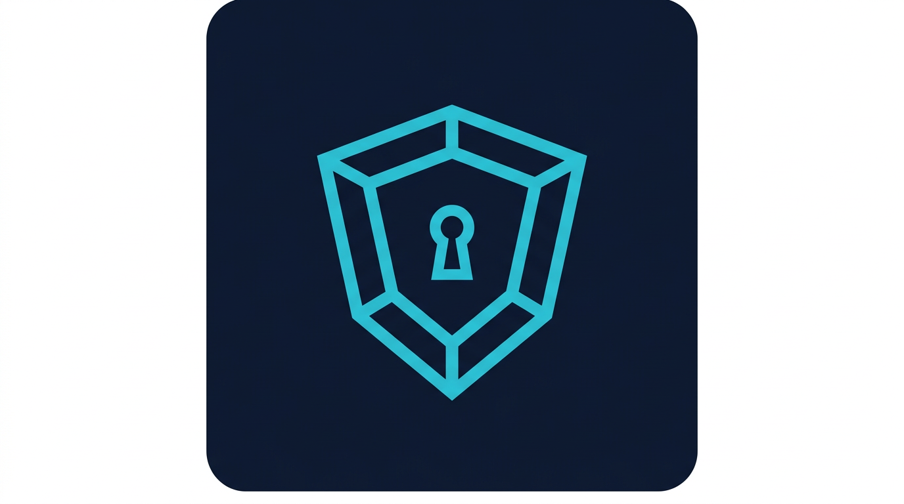

# ClaudeSec

<p align="center">
  
</p>

> AI Security Best Practices toolkit for secure development with Claude Code

[](https://github.com/Twodragon0/claudesec/stargazers)
[](LICENSE)
[](CONTRIBUTING.md)
[](https://scorecard.dev/)
[](https://owasp.org/Top10/)

ClaudeSec integrates security best practices directly into your AI-powered development workflow. It provides security-focused prompts, hooks, templates, and guides designed for use with [Claude Code](https://docs.anthropic.com/en/docs/claude-code) and CI/CD pipelines.

**Zero config, one command.** Like [oh-my-claudecode](https://github.com/Yeachan-Heo/oh-my-claudecode) — clone, setup, run.

## Branding

- **Logo**: `assets/claudesec-logo.png` (shield + lock motif)
- **Accent color**: `#38bdf8` (dashboard + docs highlight)
- **Guides**: [BRANDING.md](BRANDING.md) (quick) · [docs/branding.md](docs/branding.md) (full) · [assets/README.md](assets/README.md)

---

## Quick Start

**Step 1: Clone**

```bash
git clone https://github.com/Twodragon0/claudesec.git
cd claudesec
```

**Step 2: Setup** (optional — for hooks and GitHub Actions in another project)

```bash
./scripts/setup.sh                    # setup current dir (repo)
./scripts/setup.sh /path/to/project   # setup another project
./scripts/setup.sh --scan-only        # only scanner readiness (config + deps)
```

**Step 3: Run**

```bash
./run
```

That’s it. Full scan runs, the HTML dashboard is generated, and a local server starts at **http://localhost:11777**. Open the link to view the dashboard.

| Command | What it does |
|--------|----------------|
| `./run` | Full scan + dashboard + serve at http://localhost:11777 |
| `./run --no-serve` | Full scan + dashboard only (no server) |
| `./run --quick` | Quick scan (3 categories) + dashboard + serve |

Or run the script directly:

```bash
./scripts/run-full-dashboard.sh              # full + serve
./scripts/run-full-dashboard.sh --no-serve   # full, no server
./scripts/run-full-dashboard.sh --quick      # quick + serve
```

### Not sure where to start?

From the repo root, run `./run`. The first run may take a few minutes (full scan); use `./run --quick` for a faster try with 3 categories. The dashboard opens at **http://localhost:11777**.

---

## Why ClaudeSec?

AI coding assistants accelerate development — but speed without security creates risk. ClaudeSec bridges this gap:

- **Shift-left security**: Catch vulnerabilities before they reach production
- **AI-native guardrails**: Security hooks and prompts designed for Claude Code workflows
- **AI Security automation**: GitHub Actions, pre-commit hooks, and CI/CD templates
- **SaaS security scanning**: Datadog, Cloudflare, Vercel, ArgoCD, Sentry, Okta, SendGrid, and more
- **Supply chain integrity**: SLSA, SBOM, and artifact signing workflows
- **Compliance mapping**: SOC 2, ISO 27001, NIST, PCI-DSS, KISA ISMS-P, KISA 주요정보통신기반시설
- **Living documentation**: Actionable guides for OWASP Top 10, MITRE ATLAS, and more

## Scanner CLI

ClaudeSec includes a zero-dependency bash scanner that checks your project for security best practices across 10 categories (~120+ checks). Optionally integrates with [Prowler](https://github.com/prowler-cloud/prowler) for deep multi-cloud scanning.

**스캔 실행 (Run scan)**

```bash
# From repo root: run full scan
./scripts/run-scan.sh

# Or call the scanner directly (use -d for scan directory)
./scanner/claudesec scan -d .

# Run all checks
./scanner/claudesec scan

# Scan specific categories
./scanner/claudesec scan --category cloud
./scanner/claudesec scan --category ai,cicd

# Filter by severity
./scanner/claudesec scan --severity high,critical

# Output formats
./scanner/claudesec scan --format json
./scanner/claudesec scan --format markdown

# With compliance mapping
./scanner/claudesec scan --compliance iso27001
./scanner/claudesec scan --compliance isms-p

# AWS SSO login + cloud scan
./scanner/claudesec scan -c cloud --aws-profile audit --aws-sso

# Prowler deep scan (requires prowler installed)
./scanner/claudesec scan -c prowler --aws-profile audit
# Default provider set for `scan -c prowler`: aws,gcp,googleworkspace
# Override in .claudesec.yml with: prowler_providers: aws,gcp,googleworkspace

# AWS SSO: login ALL profiles from ~/.aws/config and scan each account
./scanner/claudesec scan -c prowler --aws-sso-all
# .claudesec.yml default is aws_sso: all
# Optional: skip profile login after timeout (seconds)
AWS_SSO_LOGIN_TIMEOUT=90 ./scanner/claudesec scan -c prowler --aws-sso-all
# CI recommendation: reduce waiting + quieter logs (set both CLAUDESEC_CI and CI)
AWS_SSO_LOGIN_TIMEOUT=20 CLAUDESEC_CI=1 CI=true ./scanner/claudesec scan -c prowler --aws-sso-all -f json

# If a profile frequently fails with ForbiddenException (e.g., dd-535),
# check AWS IAM Identity Center role assignment for that account/profile.
# Quick verify sequence (admin profile required):
# Required actions: sso:ListPermissionSets, sso:ListAccountAssignments, sso:ListInstances
# aws sso-admin list-instances --query 'Instances[0].[InstanceArn,IdentityStoreId]' --output text
# aws sso-admin list-permission-sets --instance-arn <InstanceArn> --max-results 10
# aws identitystore list-users --identity-store-id <IdentityStoreId> --filters AttributePath=UserName,AttributeValue=<UserName>
# aws sso-admin list-account-assignments --instance-arn <InstanceArn> --account-id <AccountId> --permission-set-arn <PermissionSetArn>
# To always validate list-account-assignments in templates/prowler.yml, set these GitHub Actions secrets:
# AWS_SSO_ACCOUNT_ID=<12-digit-account-id>
# AWS_SSO_PERMISSION_SET_ARN=arn:aws:sso:::permissionSet/ssoins-.../ps-...

# Prowler with Kubernetes (use .claudesec.yml or CLI; do not commit paths with company/personal paths)
./scanner/claudesec scan -c prowler --kubeconfig /path/to/your/kubeconfig
# Or set kubeconfig/aws_profile in .claudesec.yml (gitignored) and run: ./scanner/claudesec scan -c prowler

# Dashboard with Prowler (checks ~/.aws/credentials profile + kubeconfig, runs AWS + K8s Prowler, shows report)
cp templates/claudesec-prowler-k8s.example.yml .claudesec.yml   # edit kubeconfig + aws_profile
./scanner/claudesec dashboard -c prowler
./scanner/claudesec dashboard -c prowler --serve   # open at http://127.0.0.1:11665

# Prowler multi-provider (AWS/K8s/LLM/Google Workspace/M365/Cloudflare/NHN)
# 1) Copy example to local config (gitignored)
#    cp templates/claudesec-prowler-multiprovider.example.yml .claudesec.yml
# 2) Export required env vars (tokens/keys) and run:
#    ./scanner/claudesec scan -c prowler

# Auto-load Datadog / Google Workspace credentials from ~/.claudesec.env
# Supported keys: DD_API_KEY, DATADOG_API_KEY, DD_APP_KEY, DD_SITE,
#                 GOOGLE_WORKSPACE_CUSTOMER_ID, GOOGLE_APPLICATION_CREDENTIALS,
#                 GH_TOKEN, GITHUB_TOKEN,
#                 OKTA_OAUTH_TOKEN, OKTA_API_TOKEN,
#                 GH_TOKEN_EXPIRES_AT, GITHUB_TOKEN_EXPIRES_AT, OKTA_OAUTH_TOKEN_EXPIRES_AT,
#                 DATADOG_TOKEN_EXPIRES_AT, DD_TOKEN_EXPIRES_AT, DD_API_KEY_EXPIRES_AT,
#                 SLACK_TOKEN_EXPIRES_AT, SLACK_BOT_TOKEN_EXPIRES_AT,
#                 CLAUDESEC_STRICT_OKTA_SCOPES,
#                 CLAUDESEC_OKTA_REQUIRED_SCOPES,
#                 CLAUDESEC_TOKEN_EXPIRY_PROVIDERS,
#                 CLAUDESEC_TOKEN_EXPIRY_WARNING_24H, CLAUDESEC_TOKEN_EXPIRY_WARNING_7D
# Override path with: CLAUDESEC_ENV_FILE=/path/to/.env
# Datadog CI tags used by workflow query standard:
#   service:prowler env:ci ci_pipeline_id:<github.run_id>
# Keep CI logs sanitized before upload; avoid raw emails/IP/account IDs in artifacts.

# Strict SSO mode for templates/prowler.yml:
#   vars.CLAUDESEC_STRICT_SSO=1
# Default is strict (1). missing AWS_SSO_ACCOUNT_ID/AWS_SSO_PERMISSION_SET_ARN fails the workflow.
# Set vars.CLAUDESEC_STRICT_SSO=0 only when you intentionally allow skip behavior.
# Token-expiry gate for templates/prowler.yml (pre-deploy safety gate):
#   vars.GH_TOKEN_EXPIRES_AT=2026-03-20T09:00:00Z
#   vars.OKTA_OAUTH_TOKEN_EXPIRES_AT=2026-03-20T09:00:00Z
#   vars.CLAUDESEC_TOKEN_EXPIRY_GATE_MODE=24h   # 24h(default) | 7d | off
#   vars.CLAUDESEC_TOKEN_EXPIRY_PROVIDERS=github,okta,datadog,slack
# Workflow fails when token is expired or inside selected gate window.
# Same gate policy is also applied in templates/security-scan-suite.yml.
# Both templates call shared script: scripts/token-expiry-gate.py

# SaaS API scanning
./scanner/claudesec scan -c saas

### Onboarding: Okta

Okta recommends using **scoped OAuth 2.0 access tokens** over SSWS API tokens for automation.

- **Preferred**: `OKTA_OAUTH_TOKEN` (Bearer token)
- **Fallback**: `OKTA_API_TOKEN` (SSWS token)

**Why OAuth?**
- **Least Privilege**: Scopes like `okta.users.read` limit access.
- **Short-lived**: Tokens expire in 1 hour, reducing risk if leaked.
- **Auditing**: Better visibility into which app is making requests.

**Setup**:
1. Create an OIDC Service App in Okta.
2. Grant required scopes (e.g., `okta.users.read`).
3. Use Client Credentials flow to get an access token.

See [Okta Official Guidance](https://developer.okta.com/docs/guides/implement-oauth-for-okta/main/#about-oauth-2-0-for-okta-api-endpoints) for details.

# OAuth-first SaaS scan examples (GitHub + Okta)
export OKTA_ORG_URL="https://dev-123456.okta.com"
export OKTA_OAUTH_TOKEN="<okta-oauth-access-token>"   # preferred
export GH_TOKEN="<github-token>"                       # or GITHUB_TOKEN
./scanner/claudesec scan -c saas

# Optional expiry metadata for dashboard readiness warning (<24h)
export OKTA_OAUTH_TOKEN_EXPIRES_AT="2026-03-13T09:00:00Z"
export GH_TOKEN_EXPIRES_AT="2026-03-13T08:30:00Z"
# Optional threshold overrides for dashboard tiers
export CLAUDESEC_TOKEN_EXPIRY_WARNING_24H="24h"   # accepts: 24h, 1440m, 86400, etc.
export CLAUDESEC_TOKEN_EXPIRY_WARNING_7D="7d"     # accepts: 7d, 168h, 604800, etc.
./scanner/claudesec dashboard

# Strict OAuth scope mode (CI fail-fast)
export CLAUDESEC_STRICT_OKTA_SCOPES=1
# Required scopes: okta.users.read, okta.policies.read, okta.logs.read
export CLAUDESEC_OKTA_REQUIRED_SCOPES="okta.users.read,okta.policies.read,okta.logs.read"
# Optional token-expiry providers for CI gate script
export CLAUDESEC_TOKEN_EXPIRY_PROVIDERS="github,okta,datadog,slack"
./scanner/claudesec scan -c saas

# If OAuth token is not available yet, Okta API token fallback still works
export OKTA_API_TOKEN="<okta-api-token>"
./scanner/claudesec scan -c saas

# Generate HTML dashboard
./scanner/claudesec dashboard

# Microsoft best-practice source filter (Audit Points > Windows/Intune/M365)
# all: show all trust levels (default)
CLAUDESEC_MS_SOURCE_FILTER=all ./scanner/claudesec dashboard
# official,gov: show only Microsoft Official + Government sources
CLAUDESEC_MS_SOURCE_FILTER=official,gov ./scanner/claudesec dashboard
# none: hide Microsoft source area for A/B comparison
CLAUDESEC_MS_SOURCE_FILTER=none ./scanner/claudesec dashboard
# none means complete hide mode (0 source shown in Microsoft section)
# invalid tokens are ignored; only valid tokens (all/official/gov/community/none) are applied
# migration window: legacy localStorage key `claudesec.msSourcePreset` will be removed after 1-2 releases (target: v0.7.0)
# Optional: include ScubaGear when filter allows Government sources
CLAUDESEC_MS_INCLUDE_SCUBAGEAR=1 CLAUDESEC_MS_SOURCE_FILTER=official,gov ./scanner/claudesec dashboard

# Datadog Cloud Security local auto-fetch (signals/cases + logs to .claudesec-datadog/)
DD_API_KEY=<your-dd-api-key> DD_APP_KEY=<your-dd-app-key> DD_SITE=datadoghq.com ./scanner/claudesec dashboard
# DD_SITE examples: datadoghq.eu, us3.datadoghq.com, ddog-gov.com
# Debug options: CLAUDESEC_DEBUG=1, CLAUDESEC_DEBUG_VERBOSE=1, CLAUDESEC_DD_SOFT_THROTTLE_THRESHOLD=2 (recommended range: 1~5)
# Optional: disable local Datadog auto-fetch
CLAUDESEC_DATADOG_FETCH_CLOUD_SECURITY=0 ./scanner/claudesec dashboard

# Datadog API troubleshooting (quick)
| HTTP | Meaning | Action |
| --- | --- | --- |
| 401 | API key invalid | Check `DD_API_KEY` / `DATADOG_API_KEY` and site (`DD_SITE`) |
| 403 | App key scope 부족 | Reissue `DD_APP_KEY` with security/cases read scopes |
| 429 | Rate limit reached | Increase `CLAUDESEC_DD_SOFT_THROTTLE_THRESHOLD`, retry after reset |
| 5xx | Datadog server/transient | Retry (built-in backoff), rerun after short delay |

# Generate + serve dashboard on localhost
./scanner/claudesec dashboard --serve

# Custom host/port
./scanner/claudesec dashboard --serve --host 127.0.0.1 --port 11665

# Include additional categories (e.g., infra, cloud, prowler)
./scanner/claudesec dashboard -c infra,ai,network,access-control,cicd,code
./scanner/claudesec dashboard -c prowler --aws-profile <your-profile> --aws-sso
./scanner/claudesec dashboard -c prowler --aws-sso-all    # scan all SSO profiles
```

### Datadog Required Tag Contract

Use these required tags across CI workflow templates when querying/sending Datadog logs:

- `service:<workflow-service-name>` (example: `service:prowler`)
- `env:ci`
- `ci_pipeline_id:${{ github.run_id }}`

Contract query format:

```text
service:${DD_SERVICE} env:${DD_ENV} ci_pipeline_id:${CI_PIPELINE_ID}
```

Datadog ingest contract (CI log intake):

```text
POST /v1/input?ddtags=service:${DD_SERVICE},env:${DD_ENV},ci_pipeline_id:${CI_PIPELINE_ID}
```

Recommended reusable env keys in workflow templates:

```yaml
env:
  DD_SERVICE: <workflow-service-name>
  DD_ENV: ci
  CI_PIPELINE_ID: ${{ github.run_id }}
```

**네트워크·보안 툴 (Network & security tools)**  
The dashboard includes a **네트워크·보안 툴** tab when you run the `network` category. It aggregates:

- **Trivy** — vulnerability and misconfiguration scan (filesystem + config); results in `.claudesec-network/` and in the dashboard.
- **Nmap / SSLScan** — optional; enable in `.claudesec.yml` with `network_scan_enabled: true` and `network_scan_targets: "host:443"` (only scan hosts you are authorized to scan).

See `templates/claudesec-network.example.yml` for config. Trivy runs by default when installed; Nmap/SSLScan run only when explicitly enabled and targets are set.

### Scanner Categories

| Category | Checks | Covers |
|----------|--------|--------|
| `infra` | 16 | Docker, Kubernetes, IaC (Terraform/Helm) |
| `ai` | 9 | LLM API keys, prompt injection, RAG, agent tools |
| `network` | 5+ | TLS, security headers, CORS, firewall rules; Trivy (vuln/misconfig), optional Nmap/SSLScan → dashboard tab |
| `cloud` | 13 | AWS, GCP, Azure (IAM, logging, storage, network) |
| `access-control` | 6 | .env files, password hashing, JWT, sessions |
| `cicd` | 8 | GHA permissions, SHA pinning, SAST, lockfiles |
| `code` | 24 | SQL/Command/XSS injection, SSRF, XXE, crypto, deserialization, SAST tools |
| `macos` | 20 | FileVault, SIP, Gatekeeper, CIS Benchmark v4.0 |
| `windows` | 20 | KISA W-series, UAC, Firewall, Defender, SMBv1 |
| `saas` | 33 | SaaS API scanning (GitHub, Datadog, Cloudflare, Vercel, Sentry, Okta, SendGrid, Slack, PagerDuty, Jira, Grafana, New Relic, Splunk, Twilio, MongoDB Atlas, Elastic Cloud) |
| `prowler` | 16 providers | Deep scan via Prowler: AWS, Azure, GCP, K8s, GitHub, M365, Google Workspace, Cloudflare, MongoDB Atlas, Oracle Cloud, Alibaba Cloud, OpenStack, NHN, IaC, LLM, Image |

## Project Structure

```
claudesec/
├── assets/              # Logo and branding (see BRANDING.md)
├── scanner/             # Security scanner CLI (bash, zero dependencies)
│   ├── claudesec        # Main CLI entry point
│   ├── lib/             # Output formatting, helper functions
│   └── checks/          # Check modules (infra, ai, network, cloud, cicd, access-control, macos, windows, saas, prowler)
├── docs/
│   ├── devsecops/       # DevSecOps practices, OWASP, supply chain, cloud, K8s
│   ├── github/          # GitHub security features and workflows
│   ├── ai/              # AI/LLM security, MITRE ATLAS, prompt injection
│   ├── compliance/      # NIST CSF 2.0, ISO 27001/42001, KISA ISMS-P
│   ├── architecture/   # Draw.io diagrams (scanner, flow, security domains)
│   └── guides/          # Getting started, compliance mapping, branding
├── templates/           # GitHub Actions workflow templates, example configs
├── scripts/             # Security automation scripts (run, setup, run-full-dashboard)
├── hooks/               # Claude Code security hooks
├── examples/            # Example configurations
└── .github/             # Issue templates, CI workflows
```

## Documentation

- **[Branding](BRANDING.md)** — Logo and visual identity ([docs/branding.md](docs/branding.md))

### DevSecOps

| Guide | Description |
|-------|-------------|
| [OWASP Top 10 2025](docs/devsecops/owasp-top10-2025.md) | All 10 categories with controls and code examples |
| [Supply Chain Security](docs/devsecops/supply-chain-security.md) | SLSA, SBOM, Sigstore, OpenSSF Scorecard |
| [Cloud Security Posture](docs/devsecops/cloud-security-posture.md) | CSPM with Prowler, multi-cloud checklist |
| [Kubernetes Security](docs/devsecops/kubernetes-security.md) | Pod security, RBAC, NetworkPolicy, runtime |
| [DevSecOps Pipeline](docs/devsecops/pipeline.md) | End-to-end secure CI/CD pipeline |
| [Audit Checklist](docs/devsecops/audit-checklist.md) | 80+ audit points for CI/CD, DB, server, K8s |
| [Security Maturity (SAMM)](docs/devsecops/security-maturity.md) | OWASP SAMM assessment and roadmap |
| [Threat Modeling](docs/devsecops/threat-modeling.md) | AI-assisted STRIDE threat modeling |
| [Security Champions](docs/devsecops/security-champions.md) | Building security culture at scale |
| [macOS CIS Security](docs/devsecops/macos-cis-security.md) | CIS Benchmark v4.0 hardening guide |

### AI Security

| Guide | Description |
|-------|-------------|
| [OWASP LLM Top 10 2025](docs/ai/llm-top10-2025.md) | LLM-specific risks including agentic AI |
| [MITRE ATLAS](docs/ai/mitre-atlas.md) | AI threat framework with 66 techniques |
| [Prompt Injection Defense](docs/ai/prompt-injection.md) | Multi-layer defense strategies |
| [AI Code Review](docs/ai/code-review.md) | OWASP-aligned AI-assisted security review |
| [LLM Security Checklist](docs/ai/llm-security-checklist.md) | Pre-deployment security checklist |

### GitHub Security

| Guide | Description |
|-------|-------------|
| [GitHub Security Features](docs/github/security-features.md) | Dependabot, CodeQL, secret scanning |
| [Branch Protection](docs/github/branch-protection.md) | Rulesets, CODEOWNERS, environment protection |
| [Actions Security](docs/github/actions-security.md) | Supply chain hardening for CI/CD |
| [CI Operations Playbook](docs/github/ci-operations-playbook.md) | CodeQL default setup policy, docs prechecks, 401 retry, Dependabot conflict handling |

### Compliance

| Guide | Description |
|-------|-------------|
| [NIST CSF 2.0](docs/compliance/nist-csf-2.md) | 6 functions including new Govern, SP 800-53 control families |
| [ISO 27001:2022](docs/compliance/iso27001-2022.md) | 93 controls in 4 themes, 11 new controls |
| [ISO 42001:2023](docs/compliance/iso42001-ai.md) | AI Management System (AIMS) with Annex A controls |
| [KISA ISMS-P](docs/compliance/isms-p.md) | 102 certification items for Korean compliance |
| KISA 주요정보통신기반시설 | Windows W-01~W-84, Unix U-01~U-72, PC-01~PC-19 (175 items) |

### Guides

| Guide | Description |
|-------|-------------|
| [Getting Started](docs/guides/getting-started.md) | Quick setup guide |
| [Compliance Mapping](docs/guides/compliance-mapping.md) | SOC 2, ISO 27001, NIST, PCI-DSS, KISA ISMS-P |
| [Hourly Operations](docs/guides/hourly-operations.md) | Hourly cron automation with OpenCode pull and continuous improvement loop |
| [Compliance Scan Priority](docs/guides/compliance-scan-integration-priority.md) | Prowler, Lynis, tool priorities and frameworks |
| [Claude Lead Agents](docs/guides/claude-lead-agents-and-best-practices.md) | Multi-agent roles and handoff format |
| [Branding](docs/branding.md) | Logo, colors, and visual identity |

## Templates

Ready-to-use GitHub Actions workflows:

| Template | Purpose |
|----------|---------|
| [codeql.yml](templates/codeql.yml) | CodeQL static analysis |
| [dependency-review.yml](templates/dependency-review.yml) | Block PRs with vulnerable deps |
| [prowler.yml](templates/prowler.yml) | Cloud security posture scan |
| [security-scan-suite.yml](templates/security-scan-suite.yml) | CodeQL + Semgrep + Trivy + Gitleaks + OSV-Scanner (SARIF → Code scanning) |
| [sbom.yml](templates/sbom.yml) | SBOM generation + vulnerability scan + signing |
| [scorecard.yml](templates/scorecard.yml) | OpenSSF Scorecard health check |
| [SECURITY.md](templates/SECURITY.md) | Security policy template |
| [dependabot.yml](templates/dependabot.yml) | Dependabot configuration |

## Hooks

Claude Code security hooks for real-time protection:

| Hook | Trigger | Purpose |
|------|---------|---------|
| [security-lint.sh](hooks/security-lint.sh) | PreToolUse (Write/Edit) | Blocks hardcoded secrets, injection patterns |
| [secret-check.sh](hooks/secret-check.sh) | Pre-commit | Prevents committing secrets |

```json
{
  "hooks": {
    "PreToolUse": [
      {
        "matcher": "Write|Edit",
        "command": "bash hooks/security-lint.sh"
      }
    ]
  }
}
```

See [hooks/README.md](hooks/README.md) for details.

## Security Coverage Map

```
                    ClaudeSec Coverage
┌──────────────────────────────────────────────────┐
│  PLAN          BUILD          TEST         DEPLOY │
│  ┌──────┐     ┌──────┐     ┌──────┐     ┌──────┐│
│  │Threat│     │Secret│     │SAST  │     │CSPM  ││
│  │Model │     │Scan  │     │DAST  │     │IaC   ││
│  │Design│     │SCA   │     │Pentest│    │K8s   ││
│  │Review│     │SBOM  │     │Fuzz  │     │Cloud ││
│  └──────┘     └──────┘     └──────┘     └──────┘│
│                                                   │
│  MONITOR       COMPLY        AI SAFETY            │
│  ┌──────┐     ┌──────┐     ┌──────┐              │
│  │Audit │     │SOC2  │     │LLM   │              │
│  │Alert │     │ISO   │     │ATLAS │              │
│  │SIEM  │     │NIST  │     │Agent │              │
│  │IR    │     │PCI   │     │RAG   │              │
│  └──────┘     └──────┘     └──────┘              │
└──────────────────────────────────────────────────┘
```

## Contributing

We welcome contributions! See [CONTRIBUTING.md](CONTRIBUTING.md) for guidelines.

### Areas We Need Help

- Language-specific security guides (Python, Go, Rust, Java)
- Additional CI/CD integrations (GitLab CI, Azure DevOps)
- Real-world case studies and incident post-mortems
- Translations (i18n) — especially Korean, Japanese, Chinese
- Custom CodeQL queries and Semgrep rules
- Kubernetes admission policies (Kyverno/OPA)

## Acknowledgments

- Cloud security patterns from [prowler-cloud/prowler](https://github.com/prowler-cloud/prowler)
- Audit framework informed by [querypie/audit-points](https://github.com/querypie/audit-points)
- Web security based on [OWASP Top 10 2025](https://github.com/OWASP/Top10/tree/master/2025)
- AI security guidance from [MITRE ATLAS](https://atlas.mitre.org/) and [OWASP LLM Top 10](https://owasp.org/www-project-top-10-for-large-language-model-applications/)
- Built for the [Claude Code](https://docs.anthropic.com/en/docs/claude-code) ecosystem

## Support this project

If ClaudeSec helps your DevSecOps or AI-assisted security workflow, consider giving it a **star** on GitHub — it helps others discover the project.

[](https://github.com/Twodragon0/claudesec/stargazers)

## Star History

[](https://www.star-history.com/#Twodragon0/claudesec&type=date&legend=top-left)

## License

MIT License — see [LICENSE](LICENSE) for details.
