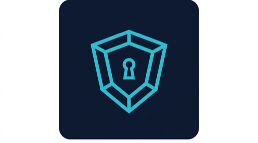
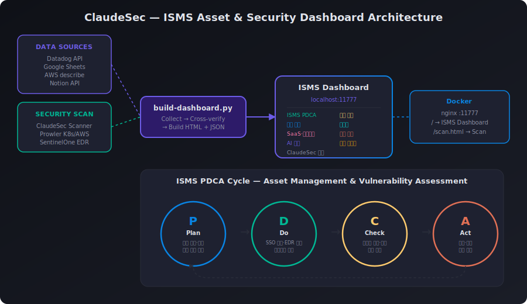

# ClaudeSec

<p align="center">
  
  <span>&nbsp;&nbsp;</span>
  
</p>

> AI Security Best Practices toolkit for secure development with Claude Code

[](https://www.npmjs.com/package/claudesec)
[](https://codecov.io/gh/Twodragon0/claudesec)
[](https://github.com/Twodragon0/claudesec/stargazers)
[](LICENSE)
[](CONTRIBUTING.md)
[](https://scorecard.dev/)
[](https://owasp.org/Top10/)

ClaudeSec integrates security best practices directly into your AI-powered development workflow. It provides security-focused prompts, hooks, templates, and guides designed for use with [Claude Code](https://docs.anthropic.com/en/docs/claude-code) and CI/CD pipelines.

## Quick Start

**npx (no install)**

```bash
npx claudesec scan                # Security scan — no install needed
npx claudesec dashboard           # Full scan + dashboard (safe local runner)
```

**Git clone + local-safe default**

```bash
git clone https://github.com/Twodragon0/claudesec.git
cd claudesec
npm run dashboard                 # Safe mode (port fallback, no Docker requirement)
./scripts/quick-start.sh          # Docker-first mode (auto local fallback)
```

**Claude Code slash commands**

```
/scan                             # Run security scan
/dashboard                        # Build + serve dashboard
/audit                            # Full security audit
/team-scan                        # Parallel multi-agent scan
/security-review                  # Pre-commit security check
```

Dashboard serves at **`http://localhost:11777/`**

**Options**

```bash
npx claudesec scan                      # Scan only
npx claudesec dashboard                 # Full scan + dashboard
./scripts/quick-start.sh --scan-only    # Scan + dashboard build only (no serve)
./scripts/quick-start.sh --serve        # Serve existing dashboard
./scripts/quick-start.sh --docker-only  # Fail fast when Docker is unavailable
```

**Asset Management Dashboard** (optional — requires API keys)

```bash
cp .env.example ~/Desktop/.env          # Edit with your API keys
./scripts/setup.sh                      # Install hooks + templates
./scripts/setup-legal-intel.sh          # Optional: local legalize-kr mirror + GitHub Repo MCP
source .venv-asset/bin/activate
python3 scripts/build-dashboard.py      # Build asset dashboard
docker compose up dashboard -d          # Serve on localhost:11777
```

> Requires: Docker Desktop. See [.env.example](.env.example) for API key setup.

| Command | What it does |
|--------|----------------|
| `./run` | Full scan + dashboard + serve at `localhost:11777` (safe mode: `--kill-port`) |
| `./run --no-serve` | Full scan + dashboard only (no server) |
| `./run --quick` | Quick scan (3 categories) + dashboard + serve |
| `./run --docker` | Full scan + dashboard in Docker (publishes `localhost:11777`) |
| `./scripts/run-dashboard-safe.sh` | Full scan + serve with automatic port fallback/cleanup options |

Or run the script directly:

```bash
./scripts/run-full-dashboard.sh              # full + serve
./scripts/run-full-dashboard.sh --no-serve   # full, no server
./scripts/run-full-dashboard.sh --quick      # quick + serve
./scripts/run-dashboard-safe.sh              # full + serve (auto fallback port when 11777 is busy)
./scripts/run-dashboard-safe.sh --kill-port  # full + serve (terminate process occupying 11777)
./scripts/run-dashboard-safe.sh --docker     # run dashboard workflow in Docker
```

### Docker Run

The default image runs **local scanner** categories (code, access-control, infra, cicd, saas, etc.) and now includes **kubectl + prowler CLI** so `-c prowler` / Kubernetes scans can also run inside Docker (assuming you mount credentials/kubeconfig). For production-grade cloud/K8s scanning, prefer running on the host with `--kubeconfig` and AWS/GCP/Azure SSO profiles, or use a hardened custom image that adds your org-specific tooling.

```bash
# Build image once (or let wrappers auto-build)
docker build -t claudesec:local .

# Dashboard flow in Docker
./run --docker
./run --docker --no-serve
./run --docker --quick

# Scanner flow in Docker
./scripts/run-scan-docker.sh
./scripts/run-scan-docker.sh -c code
./scripts/run-scan-docker.sh -c infra
./scripts/run-scan-docker.sh -c access-control
```

Recommended day-to-day flow:

```bash
./scripts/run-dashboard-safe.sh --kill-port  # avoid port-conflict / stale-server issues
./run --quick                                # fast smoke check
./run --no-serve                             # final full scan artifact generation
grep -q "ClaudeSec local security scanner results" claudesec-dashboard.html
```

Optional Korean compliance workflow:

```bash
./scripts/setup-legal-intel.sh
./scripts/legalize-search.sh "개인정보" 개인정보보호법
```

### Not sure where to start?

From the repo root, run `./run`. The first run may take a few minutes (full scan); use `./run --quick` for a faster try with 3 categories. For container-first validation, run `./run --docker --no-serve` and check `claudesec-dashboard.html`.

---

## Why ClaudeSec?

AI coding assistants accelerate development — but speed without security creates risk. ClaudeSec bridges this gap:

- **Shift-left security**: Catch vulnerabilities before they reach production
- **AI-native guardrails**: Security hooks and prompts designed for Claude Code workflows
- **AI Security automation**: GitHub Actions, pre-commit hooks, and CI/CD templates
- **SaaS security scanning**: Datadog, Cloudflare, Vercel, ArgoCD, Sentry, Okta, SendGrid, and more
- **Supply chain integrity**: SLSA, SBOM, and artifact signing workflows
- **Compliance mapping**: SOC 2, ISO 27001, NIST, PCI-DSS, KISA ISMS-P, KISA 주요정보통신기반시설
- **Living documentation**: Actionable guides for OWASP Top 10, MITRE ATLAS, and more

## ISMS Asset & Security Dashboard

ClaudeSec provides an **ISMS PDCA-based** integrated dashboard that combines security scanning, asset management, and vulnerability assessment into a single view.

<p align="center">
  
</p>

### One Command — Full Asset Scan + Dashboard

```bash
# Full: security scan + asset collection + dashboard build + Docker serve
./run-all.sh

# Quick scan only (code, infra, cicd)
./run-all.sh --quick

# Include AWS infrastructure collection
./run-all.sh --aws

# Build dashboard only (skip scan)
./run-all.sh --build-only
```

Dashboard served at **`http://localhost:11777`** (Docker) with 9 tabs:

| Tab | Data Sources | Description |
|-----|-------------|-------------|
| **ISMS PDCA** | All sources | Plan/Do/Check/Act cycle with scores |
| **ClaudeSec Scan** | Scanner | Code, infra, CI/CD, AI security checks |
| **Security** | Prowler, Datadog SIEM | Vulnerability findings, severity distribution |
| **Asset Management** | Sheets, SentinelOne, Jamf | PC/endpoint inventory, EDR cross-verification |
| **Infrastructure** | AWS, Datadog | EC2, RDS, ElastiCache, Karpenter node detection |
| **SaaS & License** | Sheets | SaaS inventory, auth method analysis, license tracking |
| **Cost Analysis** | xlsx | Monthly SaaS spending by software/department |
| **AI Subscription** | Sheets | AI service usage (Claude, GPT, Cursor, etc.) |
| **Security Signals** | Datadog SIEM, Notion | 14-day alerts + security audit history |

### Data Collection

The dashboard aggregates data from multiple sources:

```
Data Sources                  Collection Method
─────────────────────────────────────────────────
Datadog API                   Hosts, SIEM signals, SentinelOne logs
Google Sheets API             Asset registry, SaaS, licenses
Google Drive API (xlsx)       SaaS cost/spending data
AWS CLI (describe)            EC2, RDS, ElastiCache, S3, EKS
Prowler (K8s Job)             CIS benchmark, security checks
Notion API                    Security audit history
ClaudeSec Scanner             Code, infra, CI/CD, AI checks
```

### Cross-Verification

Automatically detects discrepancies between data sources:

- **EC2 cross-verify**: AWS live instances vs asset registry (Karpenter dynamic nodes auto-excluded)
- **Endpoint cross-verify**: Jamf MDM vs SentinelOne EDR (identifies devices missing protection)
- **SaaS auth audit**: Identifies ID/PW-only services that need SSO migration

### Configuration

```bash
# Required: Google OAuth (first-time browser auth)
pip install gspread google-auth google-auth-oauthlib openpyxl

# Required: Datadog API keys in ~/Desktop/.env
# datadog_key_credential=<API_KEY>
# datadog_app_key_credential=<APP_KEY>

# Optional: AWS profiles for infrastructure collection
# Requires valid AWS CLI sessions (SSO or credentials)

# Optional: Prowler K8s CronJob (weekly scan)
kubectl apply -f .claudesec-prowler/prowler-rbac.yaml --context <dev-cluster>
kubectl apply -f .claudesec-prowler/prowler-cronjob.yaml --context <dev-cluster>
```

### Docker

```bash
# Start dashboard (nginx, port 11777)
docker compose up -d dashboard

# Endpoints:
#   http://localhost:11777           → ISMS Dashboard
#   http://localhost:11777/scan.html → ClaudeSec Scan Dashboard
```

### Directory Structure

```
claudesec/
├── run-all.sh                          # One-command: scan + build + serve
├── scripts/
│   ├── build-dashboard.py              # Dashboard data collection & HTML build
│   ├── asset-gsheet-sync.py            # Google Sheets sync
│   ├── collect-assets.sh               # Multi-source asset collector
│   ├── run-prowler-k8s.sh              # Prowler K8s scan (CronJob-based)
│   └── full-asset-sync.py              # Full sync to Google Sheets
├── claudesec-asset-dashboard.html      # Dashboard template (no data)
├── .claudesec-prowler/
│   ├── prowler-rbac.yaml               # K8s ServiceAccount + ClusterRole
│   └── prowler-cronjob.yaml            # Weekly Prowler CronJob
├── scanner/                            # ClaudeSec security scanner
├── docker-compose.yml                  # Docker stack
└── Dockerfile.nginx                    # Dashboard serving
```

> **Privacy**: All scan results, asset data, and dashboard files with real data are in `.gitignore`. Only templates and scripts are committed. No PII, company info, or credentials are included in the repository.

---

## Scanner CLI

ClaudeSec includes a zero-dependency bash scanner that checks your project for security best practices across 10 categories (~120+ checks). Optionally integrates with [Prowler](https://github.com/prowler-cloud/prowler) for deep multi-cloud scanning.

**Scanner anchors**

- [Quick Start](#scanner-quick-start)
- [CI Templates](#scanner-ci-templates)
- [OAuth and Token Policy](#scanner-oauth-and-token-policy)
- [SaaS Live Scan](#scanner-saas-live-scan)

### Scanner Quick Start

```bash
# From repo root
./scripts/run-scan.sh
./scripts/run-scan.sh --docker

# Direct CLI
./scanner/claudesec scan -d .
./scanner/claudesec scan --category cloud
./scanner/claudesec scan --severity high,critical
./scanner/claudesec scan --format json
```

### Scanner CI Templates

```bash
# Prowler deep scan (requires prowler)
./scanner/claudesec scan -c prowler --aws-profile audit

# AWS SSO all profiles
./scanner/claudesec scan -c prowler --aws-sso-all
AWS_SSO_LOGIN_TIMEOUT=20 CLAUDESEC_CI=1 CI=true ./scanner/claudesec scan -c prowler --aws-sso-all -f json

# Strict SSO mode for templates/prowler.yml
# vars.CLAUDESEC_STRICT_SSO=1

# Token-expiry gate vars for templates/prowler.yml / templates/security-scan-suite.yml
# vars.GH_TOKEN_EXPIRES_AT=2026-03-20T09:00:00Z
# vars.OKTA_OAUTH_TOKEN_EXPIRES_AT=2026-03-20T09:00:00Z
# vars.CLAUDESEC_TOKEN_EXPIRY_GATE_MODE=24h
# vars.CLAUDESEC_TOKEN_EXPIRY_PROVIDERS=github,okta,datadog,slack
# vars.CLAUDESEC_TOKEN_EXPIRY_STRICT_PROVIDERS=true
# vars.CLAUDESEC_DD_ARTIFACT_RETENTION_DAYS=30   # valid range: 1-90
```

Reusable workflow components:

- `.github/actions/token-expiry-gate`
- `.github/actions/datadog-ci-collect`

### Scanner OAuth and Token Policy

Okta recommends **scoped OAuth 2.0 access tokens** over SSWS API tokens for automation.

- Preferred: `OKTA_OAUTH_TOKEN`
- Fallback: `OKTA_API_TOKEN`
- Strict scope check: `CLAUDESEC_STRICT_OKTA_SCOPES=1`
- Required scopes override: `CLAUDESEC_OKTA_REQUIRED_SCOPES`

```bash
export OKTA_ORG_URL="https://dev-123456.okta.com"
export OKTA_OAUTH_TOKEN="<okta-oauth-access-token>"
export GH_TOKEN="<github-token>"
export CLAUDESEC_OKTA_REQUIRED_SCOPES="okta.users.read,okta.policies.read,okta.logs.read"
export CLAUDESEC_STRICT_OKTA_SCOPES=1
./scanner/claudesec scan -c saas
```

### Scanner SaaS Live Scan

```bash
# SaaS API scan
./scanner/claudesec scan -c saas

# Dashboard with token expiry windows
export OKTA_OAUTH_TOKEN_EXPIRES_AT="2026-03-13T09:00:00Z"
export GH_TOKEN_EXPIRES_AT="2026-03-13T08:30:00Z"
export CLAUDESEC_TOKEN_EXPIRY_WARNING_24H="24h"
export CLAUDESEC_TOKEN_EXPIRY_WARNING_7D="7d"
./scanner/claudesec dashboard --serve --host 127.0.0.1 --port 11665

# Optional: populate OAuth readiness cards via ~/.claudesec.env (auto-loaded)
cat > ~/.claudesec.env <<'EOF'
GH_TOKEN=<github-token>
GITHUB_TOKEN_EXPIRES_AT=2026-03-20T09:00:00Z
OKTA_OAUTH_TOKEN=<okta-oauth-token>
OKTA_OAUTH_TOKEN_EXPIRES_AT=2026-03-20T09:00:00Z
EOF
./run --no-serve

# Datadog local auto-fetch
DD_API_KEY=<your-dd-api-key> DD_APP_KEY=<your-dd-app-key> DD_SITE=datadoghq.com ./scanner/claudesec dashboard
```

### Secrets noise reduction (allowlist vs real risk)

`SECRETS-002` (`.env`) and `SECRETS-004` (credential-path references) are split by path risk:

- Non-allowlisted paths (for example `src/`, app runtime code): **FAIL** (real risk)
- Allowlisted sample paths (`templates/`, `examples/`, `docs/`, `scanner/tests/`): **WARN** (operationally allowed)

Optional custom allowlist regex:

```bash
export CLAUDESEC_SECRETS_ALLOWLIST_REGEX='^playbooks/|^internal-samples/'
./scanner/claudesec scan -c access-control
```

### CI reproducibility check (dashboard regression gate)

Use a deterministic check in CI to catch dashboard generation regressions:

```bash
./scripts/run-dashboard-docker.sh --quick --no-serve --build
./scripts/run-dashboard-docker.sh --no-serve
test -f claudesec-dashboard.html
grep -q "ClaudeSec local security scanner results" claudesec-dashboard.html
```

Advanced scanner examples (AWS SSO role troubleshooting, kubeconfig/prowler, Microsoft source filter, Datadog troubleshooting) are kept in:

- `docs/guides/getting-started.md`
- `docs/guides/workflow-components.md`
- `docs/guides/saas-best-practices-scans.md`

### Datadog Required Tag Contract

Use these required tags across CI workflow templates when querying/sending Datadog logs:

- `service:<workflow-service-name>` (example: `service:prowler`)
- `env:ci`
- `ci_pipeline_id:${{ github.run_id }}`

Contract query format:

```text
service:${DD_SERVICE} env:${DD_ENV} ci_pipeline_id:${CI_PIPELINE_ID}
```

Datadog ingest contract (CI log intake):

```text
POST /v1/input?ddtags=service:${DD_SERVICE},env:${DD_ENV},ci_pipeline_id:${CI_PIPELINE_ID}
```

Recommended reusable env keys in workflow templates:

```yaml
env:
  DD_SERVICE: <workflow-service-name>
  DD_ENV: ci
  CI_PIPELINE_ID: ${{ github.run_id }}
```

**네트워크·보안 툴 (Network & security tools)**  
The dashboard includes a **네트워크·보안 툴** tab when you run the `network` category. It aggregates:

- **Trivy** — vulnerability and misconfiguration scan (filesystem + config); results in `.claudesec-network/` and in the dashboard.
- **Nmap / SSLScan** — optional; enable in `.claudesec.yml` with `network_scan_enabled: true` and `network_scan_targets: "host:443"` (only scan hosts you are authorized to scan).

See `templates/claudesec-network.example.yml` for config. Trivy runs by default when installed; Nmap/SSLScan run only when explicitly enabled and targets are set.

### Scanner Categories

| Category | Checks | Covers |
|----------|--------|--------|
| `infra` | 16 | Docker, Kubernetes, IaC (Terraform/Helm) |
| `ai` | 9 | LLM API keys, prompt injection, RAG, agent tools |
| `network` | 5+ | TLS, security headers, CORS, firewall rules; Trivy (vuln/misconfig), optional Nmap/SSLScan → dashboard tab |
| `cloud` | 13 | AWS, GCP, Azure (IAM, logging, storage, network) |
| `access-control` | 6 | .env files, password hashing, JWT, sessions |
| `cicd` | 8 | GHA permissions, SHA pinning, SAST, lockfiles |
| `code` | 24 | SQL/Command/XSS injection, SSRF, XXE, crypto, deserialization, SAST tools |
| `macos` | 20 | FileVault, SIP, Gatekeeper, CIS Benchmark v4.0 |
| `windows` | 20 | KISA W-series, UAC, Firewall, Defender, SMBv1 |
| `saas` | 33 | SaaS API scanning (GitHub, Datadog, Cloudflare, Vercel, Sentry, Okta, SendGrid, Slack, PagerDuty, Jira, Grafana, New Relic, Splunk, Twilio, MongoDB Atlas, Elastic Cloud) |
| `prowler` | 16 providers | Deep scan via Prowler: AWS, Azure, GCP, K8s, GitHub, M365, Google Workspace, Cloudflare, MongoDB Atlas, Oracle Cloud, Alibaba Cloud, OpenStack, NHN, IaC, LLM, Image |

## Project Structure

```
claudesec/
├── assets/              # Logo and branding (see BRANDING.md)
├── scanner/             # Security scanner CLI (bash, zero dependencies)
│   ├── claudesec        # Main CLI entry point
│   ├── lib/             # Output formatting, helper functions
│   └── checks/          # Check modules (infra, ai, network, cloud, cicd, access-control, macos, windows, saas, prowler)
├── docs/
│   ├── devsecops/       # DevSecOps practices, OWASP, supply chain, cloud, K8s
│   ├── github/          # GitHub security features and workflows
│   ├── ai/              # AI/LLM security, MITRE ATLAS, prompt injection
│   ├── compliance/      # NIST CSF 2.0, ISO 27001/42001, KISA ISMS-P
│   ├── architecture/   # Draw.io diagrams (scanner, flow, security domains)
│   └── guides/          # Getting started, compliance mapping, branding
├── templates/           # GitHub Actions workflow templates, example configs
├── scripts/             # Security automation scripts (run, setup, run-full-dashboard)
├── hooks/               # Claude Code security hooks
├── examples/            # Example configurations
└── .github/             # Issue templates, CI workflows
```

## Documentation

- **[Branding](BRANDING.md)** — Logo and visual identity ([docs/branding.md](docs/branding.md))

### DevSecOps

| Guide | Description |
|-------|-------------|
| [OWASP Top 10 2025](docs/devsecops/owasp-top10-2025.md) | All 10 categories with controls and code examples |
| [Supply Chain Security](docs/devsecops/supply-chain-security.md) | SLSA, SBOM, Sigstore, OpenSSF Scorecard |
| [Cloud Security Posture](docs/devsecops/cloud-security-posture.md) | CSPM with Prowler, multi-cloud checklist |
| [Kubernetes Security](docs/devsecops/kubernetes-security.md) | Pod security, RBAC, NetworkPolicy, runtime |
| [DevSecOps Pipeline](docs/devsecops/pipeline.md) | End-to-end secure CI/CD pipeline |
| [Audit Checklist](docs/devsecops/audit-checklist.md) | 80+ audit points for CI/CD, DB, server, K8s |
| [Security Maturity (SAMM)](docs/devsecops/security-maturity.md) | OWASP SAMM assessment and roadmap |
| [Threat Modeling](docs/devsecops/threat-modeling.md) | AI-assisted STRIDE threat modeling |
| [Security Champions](docs/devsecops/security-champions.md) | Building security culture at scale |
| [macOS CIS Security](docs/devsecops/macos-cis-security.md) | CIS Benchmark v4.0 hardening guide |

### AI Security

| Guide | Description |
|-------|-------------|
| [OWASP LLM Top 10 2025](docs/ai/llm-top10-2025.md) | LLM-specific risks including agentic AI |
| [MITRE ATLAS](docs/ai/mitre-atlas.md) | AI threat framework with 66 techniques |
| [Prompt Injection Defense](docs/ai/prompt-injection.md) | Multi-layer defense strategies |
| [AI Code Review](docs/ai/code-review.md) | OWASP-aligned AI-assisted security review |
| [LLM Security Checklist](docs/ai/llm-security-checklist.md) | Pre-deployment security checklist |

### GitHub Security

| Guide | Description |
|-------|-------------|
| [GitHub Security Features](docs/github/security-features.md) | Dependabot, CodeQL, secret scanning |
| [Branch Protection](docs/github/branch-protection.md) | Rulesets, CODEOWNERS, environment protection |
| [Actions Security](docs/github/actions-security.md) | Supply chain hardening for CI/CD |
| [CI Operations Playbook](docs/github/ci-operations-playbook.md) | CodeQL default setup policy, docs prechecks, 401 retry, Dependabot conflict handling |

### Compliance

| Guide | Description |
|-------|-------------|
| [NIST CSF 2.0](docs/compliance/nist-csf-2.md) | 6 functions including new Govern, SP 800-53 control families |
| [ISO 27001:2022](docs/compliance/iso27001-2022.md) | 93 controls in 4 themes, 11 new controls |
| [ISO 42001:2023](docs/compliance/iso42001-ai.md) | AI Management System (AIMS) with Annex A controls |
| [KISA ISMS-P](docs/compliance/isms-p.md) | 102 certification items for Korean compliance |
| KISA 주요정보통신기반시설 | Windows W-01~W-84, Unix U-01~U-72, PC-01~PC-19 (175 items) |

### Guides

| Guide | Description |
|-------|-------------|
| [Getting Started](docs/guides/getting-started.md) | Quick setup guide |
| [Shell Lint Policy](docs/guides/shell-lint-policy.md) | Fixed ShellCheck scope, severity, and options policy for local and CI |
| [Compliance Mapping](docs/guides/compliance-mapping.md) | SOC 2, ISO 27001, NIST, PCI-DSS, KISA ISMS-P |
| [Workflow Components](docs/guides/workflow-components.md) | Reusable composite actions and template integration contract |
| [Hourly Operations](docs/guides/hourly-operations.md) | Hourly cron automation with OpenCode pull and continuous improvement loop |
| [Compliance Scan Priority](docs/guides/compliance-scan-integration-priority.md) | Prowler, Lynis, tool priorities and frameworks |
| [Claude Lead Agents](docs/guides/claude-lead-agents-and-best-practices.md) | Multi-agent roles and handoff format |
| [Legal Intelligence Setup](docs/guides/legal-intel-with-legalize-kr-and-github-repo-mcp.md) | legalize-kr local mirror + GitHub Repo MCP for Korean compliance workflows |
| [Branding](docs/branding.md) | Logo, colors, visual identity, **SNS link-share preview** (KakaoTalk/FB/Slack/X) |

### Link sharing & SNS preview verification

Open Graph/Twitter meta priority, image requirements per platform, and cache-invalidation
procedure live in [docs/branding.md § SNS 링크 공유 미리보기](docs/branding.md#sns-링크-공유-미리보기-kakaotalk--slack--facebook--linkedin--twitterx).
Quick contributor checks before sharing a new URL externally:

```bash
# 1. og:image reachable + correct content-type
curl -sI https://twodragon0.github.io/claudesec/assets/claudesec-logo.png \
  | grep -E '^(HTTP|content-type)'

# 2. Inspect deployed OG/Twitter meta
curl -s https://twodragon0.github.io/claudesec/ \
  | grep -E '(og:|twitter:)' | head -20

# 3. Force-refresh platform caches (manual UI step)
#    KakaoTalk : https://developers.kakao.com/tool/debugger/sharing  → URL → 초기화
#    Facebook  : https://developers.facebook.com/tools/debug/         → URL → Scrape Again
#                (Slack and LinkedIn defer to Facebook's OG cache)
```

## Templates

Ready-to-use GitHub Actions workflows:

| Template | Purpose |
|----------|---------|
| [codeql.yml](templates/codeql.yml) | CodeQL static analysis |
| [dependency-review.yml](templates/dependency-review.yml) | Block PRs with vulnerable deps |
| [prowler.yml](templates/prowler.yml) | Cloud security posture scan |
| [security-scan-suite.yml](templates/security-scan-suite.yml) | CodeQL + Semgrep + Trivy + Gitleaks + OSV-Scanner (SARIF → Code scanning) |
| [sbom.yml](templates/sbom.yml) | SBOM generation + vulnerability scan + signing |
| [scorecard.yml](templates/scorecard.yml) | OpenSSF Scorecard health check |
| [SECURITY.md](templates/SECURITY.md) | Security policy template |
| [dependabot.yml](templates/dependabot.yml) | Dependabot configuration |

## Reusable Workflow Components

| Component | Path | Used by |
|----------|------|---------|
| Token Expiry Gate | `.github/actions/token-expiry-gate` | `templates/prowler.yml`, `templates/security-scan-suite.yml` |
| Datadog CI Collect | `.github/actions/datadog-ci-collect` | `templates/prowler.yml`, `templates/security-scan-suite.yml` |

## Hooks

Claude Code security hooks for real-time protection:

| Hook | Trigger | Purpose |
|------|---------|---------|
| [security-lint.sh](hooks/security-lint.sh) | PreToolUse (Write/Edit) | Blocks hardcoded secrets, injection patterns |
| [secret-check.sh](hooks/secret-check.sh) | Pre-commit | Prevents committing secrets |

```json
{
  "hooks": {
    "PreToolUse": [
      {
        "matcher": "Write|Edit",
        "command": "bash hooks/security-lint.sh"
      }
    ]
  }
}
```

See [hooks/README.md](hooks/README.md) for details.

## ISMS Compliance Mapping

ClaudeSec scanner checks are mapped to major compliance frameworks. Each finding includes a compliance reference for audit evidence.

| ClaudeSec Category | NIST CSF 2.0 | ISO 27001:2022 | KISA ISMS-P | SOC 2 |
|-------------------|-------------|----------------|-------------|-------|
| **Code (SAST)** | DE.CM, PR.DS | A.8.4, A.8.28 | 2.9, 2.11 | CC6.1, CC7.1 |
| **CI/CD** | PR.DS, PR.PS | A.8.9, A.8.25 | 2.9, 2.10 | CC6.6, CC8.1 |
| **Access Control** | PR.AC, PR.AA | A.5.15, A.8.5 | 2.5, 2.6 | CC6.1, CC6.3 |
| **Infrastructure** | PR.IP, PR.PT | A.8.9, A.8.25 | 2.10 | CC6.6, CC7.1 |
| **Cloud** | ID.AM, PR.AC | A.5.23, A.8.26 | 2.8, 2.10 | CC6.6, CC6.7 |
| **Network** | PR.DS, DE.CM | A.8.20, A.8.21 | 2.10 | CC6.6 |
| **AI/LLM** | GV.OC, ID.RA | A.5.8 (new) | 2.9 | CC6.1, CC7.2 |
| **SaaS** | ID.AM, PR.AC | A.5.23, A.8.26 | 2.5, 2.10 | CC6.1, CC6.6 |
| **macOS/Windows** | PR.IP, PR.PT | A.8.1, A.8.9 | 2.10 | CC6.6, CC6.8 |
| **Prowler** | Full coverage | A.8, A.5 | 2.5~2.11 | CC6, CC7, CC8 |

> Full mapping details: [docs/guides/compliance-mapping.md](docs/guides/compliance-mapping.md)

### Supported Frameworks

| Framework | Version | Controls | Coverage |
|-----------|---------|----------|----------|
| NIST CSF | 2.0 | 6 Functions (GV, ID, PR, DE, RS, RC) | 120+ checks mapped |
| ISO 27001 | 2022 | 93 controls (4 themes) | Full Annex A mapping |
| ISO 42001 | 2023 | AI Management System | AI category checks |
| KISA ISMS-P | v3.0 | 102 certification items | Korean compliance |
| SOC 2 | Type II | Trust Services Criteria | CC1~CC9 mapped |
| CIS Benchmarks | v4.0 | macOS, Windows, K8s | OS hardening checks |
| OWASP | Top 10 2025 | 10 categories | Code + AI checks |
| OWASP LLM | Top 10 2025 | 10 LLM risks | AI category |

## Security Coverage Map

```
                    ClaudeSec Coverage
┌──────────────────────────────────────────────────┐
│  PLAN          BUILD          TEST         DEPLOY │
│  ┌──────┐     ┌──────┐     ┌──────┐     ┌──────┐│
│  │Threat│     │Secret│     │SAST  │     │CSPM  ││
│  │Model │     │Scan  │     │DAST  │     │IaC   ││
│  │Design│     │SCA   │     │Pentest│    │K8s   ││
│  │Review│     │SBOM  │     │Fuzz  │     │Cloud ││
│  └──────┘     └──────┘     └──────┘     └──────┘│
│                                                   │
│  MONITOR       COMPLY        AI SAFETY            │
│  ┌──────┐     ┌──────┐     ┌──────┐              │
│  │Audit │     │SOC2  │     │LLM   │              │
│  │Alert │     │ISO   │     │ATLAS │              │
│  │SIEM  │     │NIST  │     │Agent │              │
│  │IR    │     │PCI   │     │RAG   │              │
│  └──────┘     └──────┘     └──────┘              │
└──────────────────────────────────────────────────┘
```

## Contributing

We welcome contributions! See [CONTRIBUTING.md](CONTRIBUTING.md) for guidelines.

### Areas We Need Help

- Language-specific security guides (Python, Go, Rust, Java)
- Additional CI/CD integrations (GitLab CI, Azure DevOps)
- Real-world case studies and incident post-mortems
- Translations (i18n) — especially Korean, Japanese, Chinese
- Custom CodeQL queries and Semgrep rules
- Kubernetes admission policies (Kyverno/OPA)

## Acknowledgments

- Cloud security patterns from [prowler-cloud/prowler](https://github.com/prowler-cloud/prowler)
- Audit framework informed by [querypie/audit-points](https://github.com/querypie/audit-points)
- Web security based on [OWASP Top 10 2025](https://github.com/OWASP/Top10/tree/master/2025)
- AI security guidance from [MITRE ATLAS](https://atlas.mitre.org/) and [OWASP LLM Top 10](https://owasp.org/www-project-top-10-for-large-language-model-applications/)
- Built for the [Claude Code](https://docs.anthropic.com/en/docs/claude-code) ecosystem

## Support this project

If ClaudeSec helps your DevSecOps or AI-assisted security workflow, consider giving it a **star** on GitHub — it helps others discover the project.

[](https://github.com/Twodragon0/claudesec/stargazers)

## Star History

[](https://www.star-history.com/#Twodragon0/claudesec&type=date&legend=top-left)

## License

MIT License — see [LICENSE](LICENSE) for details.
